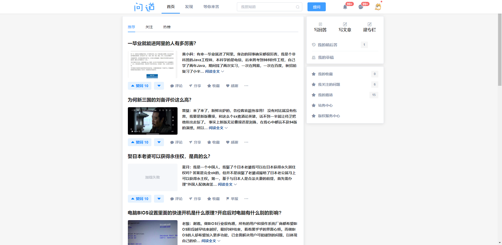
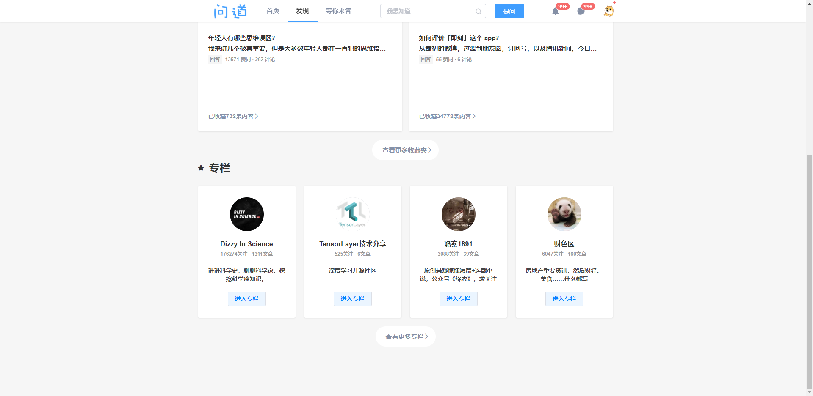
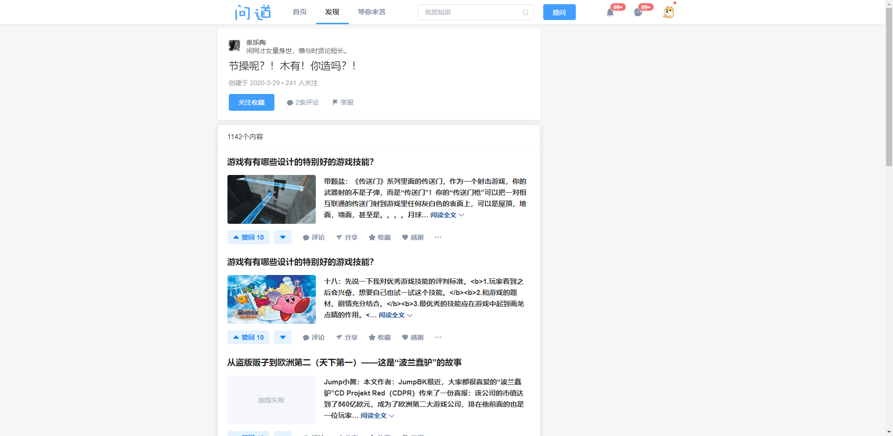
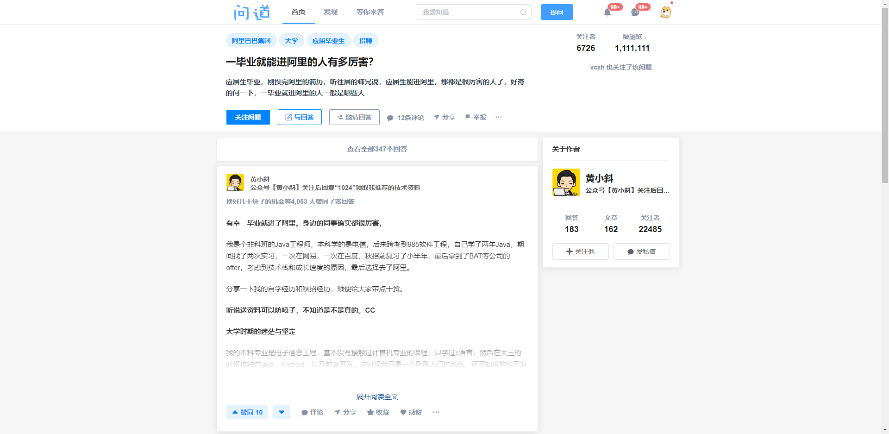
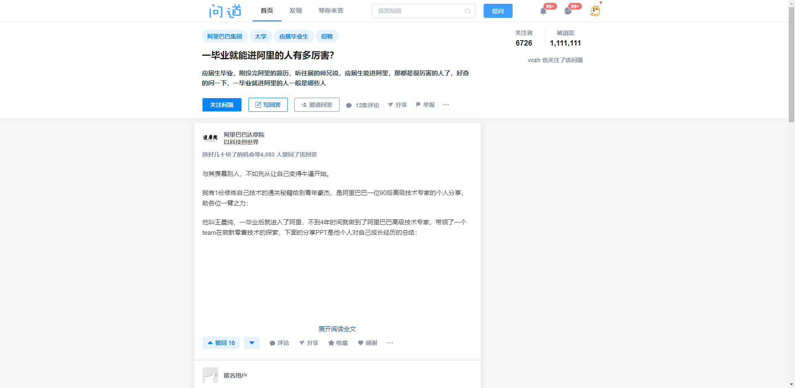
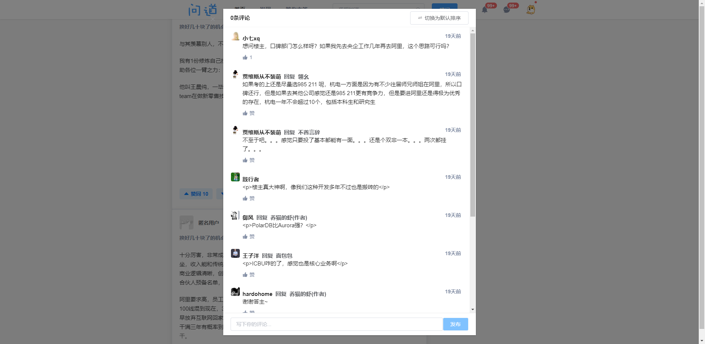
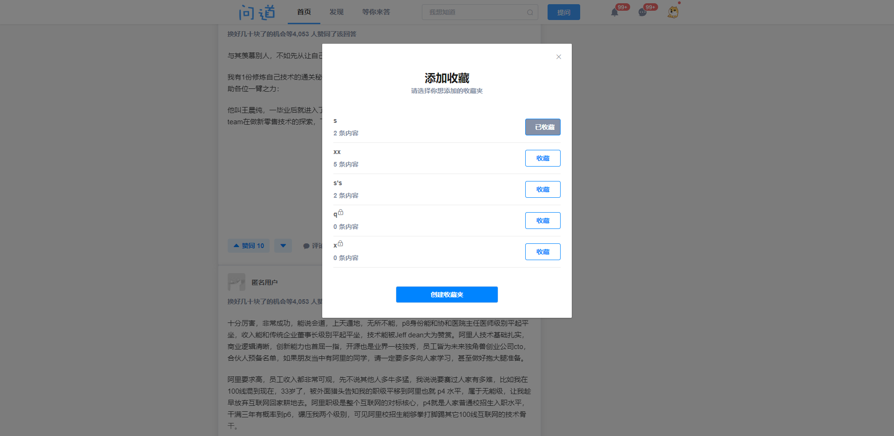
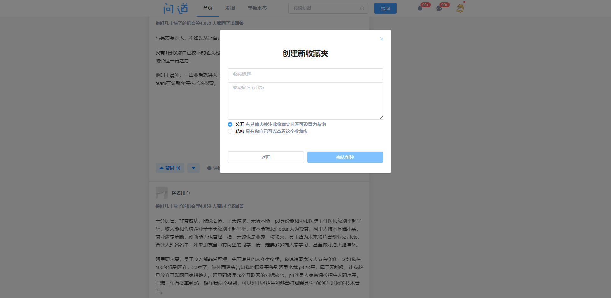

> 本系统采用python后端框架Django以及Django REST framework搭建的后端以提供给前端的简单RESTful API
>
> 前端采用的是Vue.js结合Element-UI实现的模拟仿知乎的页面（无商业用途，仅作个人学习使用，如侵删）

实现运行效果截图：

- 首页

- 发现-热门收藏夹

  

- 发现-专栏

  

- 收藏夹

  

- 回答详情

  

- 所有回答

  

- 评论

  

- 收藏

  

- 创建收藏夹

  